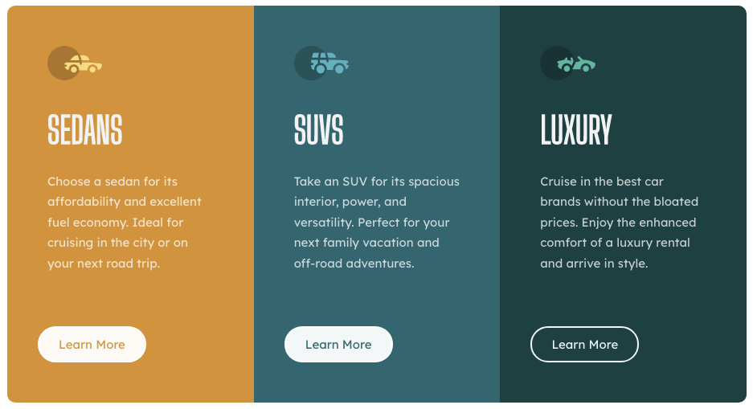

# Frontend Mentor - 3-column preview card component solution

This is a solution to the [3-column preview card component challenge on Frontend Mentor](https://www.frontendmentor.io/challenges/3column-preview-card-component-pH92eAR2-). Frontend Mentor challenges help you improve your coding skills by building realistic projects. 

## Table of contents

- [Overview](#overview)
  - [The challenge](#the-challenge)
  - [Screenshot](#screenshot)
  - [Links](#links)
- [My process](#my-process)
  - [Built with](#built-with)
  - [What I learned](#what-i-learned)
  - [Continued development](#continued-development)
  - [Useful resources](#useful-resources)
- [Acknowledgments](#acknowledgments)

**Note: Delete this note and update the table of contents based on what sections you keep.**

## Overview

### The challenge

Users should be able to:

- View the optimal layout depending on their device's screen size
- See hover states for interactive elements

### Screenshot

I hovered over the button on the Luxury column to show the transition.

### Links

My solution/code located on GitHub.  URL: https://github.com/Magnus602/Three-Column-Preview-Card.git

## My process

I started the project looking at what was provided in the .html file, what the final solution should look like, and the style-guide.  Based on the requirements, this was my sequence of events:
  - Copied the links for the required fonts listed in the style guide. 
  - Copied the link for Bootstrap, not required, but desired. 
  - Created a .css file (not provided) using terminal in VS Code.
  - Started building the HTML by wrapping tags and classes around titles, paragraphs, images, etc.
  - Built CSS and used Flexbox to make the columns flex and wrap.

### Built with

- Semantic HTML5 markup
- CSS3 custom properties
- Flexbox
- Desktop workflow provided by Frontend Mentor (proj seems to flex for mobile viewing)
- [Bootstrap](https://getbootstrap.com/) - Bootstrap library

### What I learned

I learned that classing a div as "col-md-4" isn't necessary when creating consistent widths for the three columns. I saw other solutions after I created mine, and no one used the Bootstrap method.  How I wrote it is necessary, but it can be rewritten w/o Bootstrap with the same outcome.

### Continued development

My code is in a good place but far from perfect.  There is so much I do not know.  I am continuously playing around with CSS Grid and Flexbox to ensure I achieve the desired outcome.  In addition, as it pertains to this project, I found the icons to be challenging.  I could not get the width and height to scale accurately when changing the size of the window/screen.

I want to learn more about when and WHY to use em's, rem's, and px's.

Not sure how to get the Frontend Mentor 
 to show up at the bottom of the columns.

### Useful resources

- [Bootstrap](https://getbootstrap.com/) - This helped me to flex the columns and rows. I hope to discover an easier and more readable method in the future.
- [Josh Comeau](http://www.joshcomeau.com/custom-css-reset/) - Josh has made his CSS Reset public for anyone to use.  It has improved my CSS experience by making it more consistent and aesthetically pleasing.
- [YouTube](www.youtube.com) - I like to look at solutions provided by various developers for best practices.  I'm always looking for better and cleaner ways to code.  There are many methods used to gain the same/similar result.
- [Stack Overflow](www.stackoverflow.com) - Over 100M people visit Stack Overflow every month.  When someone has a question they cannot figure out, they can ask it in this forum.  Nine times out of ten, my questions have been answered by someone else's answered question.

- GitHub - [Magnus602](https://github.com/Magnus602/Three-Column-Preview-Card.git)
- Frontend Mentor - [@Magnus602](https://www.frontendmentor.io/profile/yourusername)

## Acknowledgments

I watched a few videos after I completed my project.  I tried to implement some elements that looked interesting and all around better code, but it ended up not working with how I constructed my HTML.  Not sure why.  I still have much to learn.  Because I feel like my project is in a good place as it is, I will submit it and graciously await feedback.
